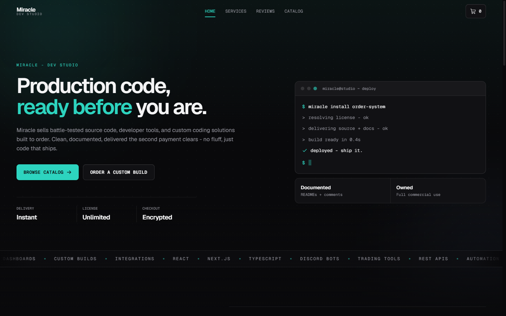
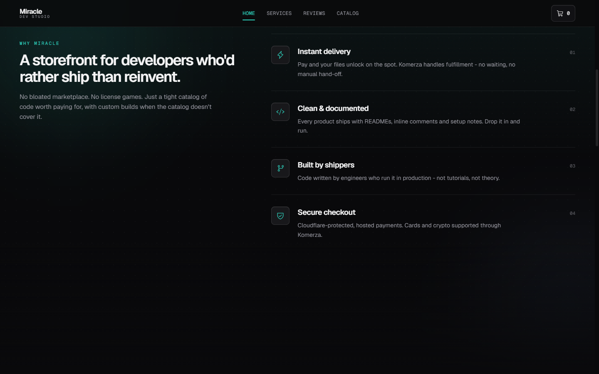
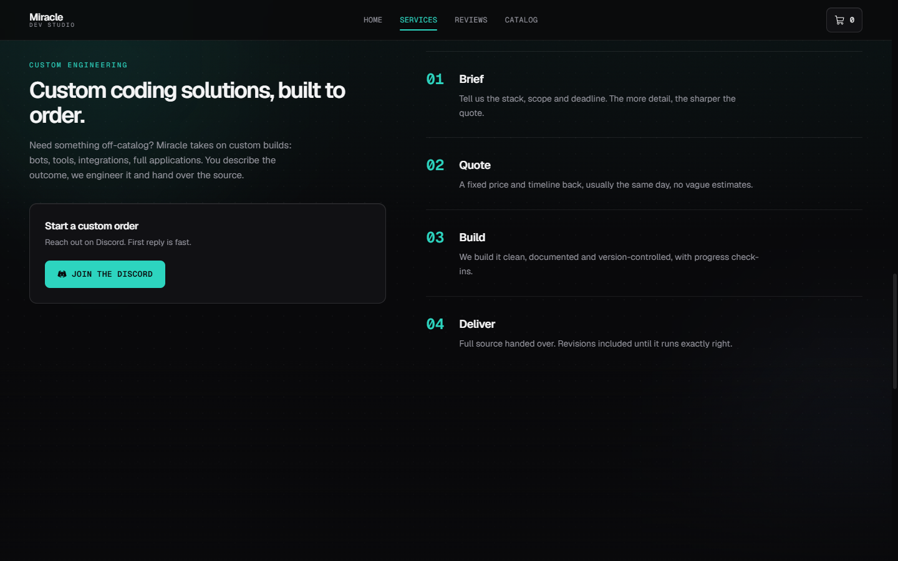
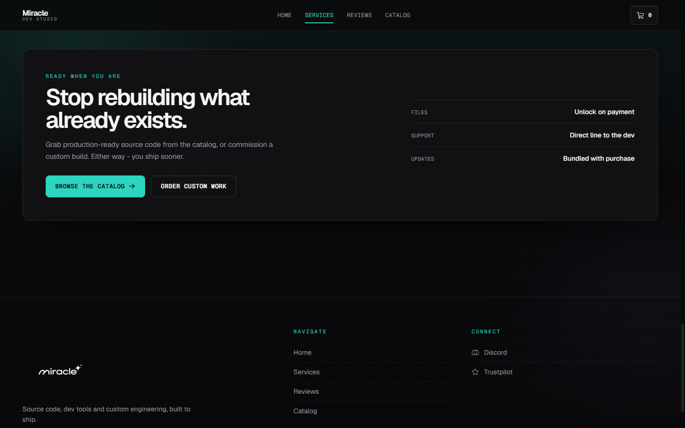

# Miracle

A custom storefront for **Miracle** a dev studio selling source code, developer
tools, and custom coding solutions built to order. Clean, documented code,
delivered the second payment clears.

Built on the [Komerza](https://komerza.com) commerce platform with a fully
custom frontend: no themes, no marketplace bloat.

**Live store:** [miracledev.mykomerza.com](https://miracledev.mykomerza.com)
-# Currently not available due to problems of Komerza with deploying custom Storefronts.

## Features

- **Live catalog** / products, variants, stock and reviews pulled straight from Komerza
- **Quick-view modal** / pick a variant, check stock, read reviews, add to cart without leaving the page
- **Slide-in cart** / quantity edits, live subtotal, persists across reloads
- **Hosted checkout** / secure payment handled by Komerza, cards and crypto supported
- **Custom engineering** / a built-to-order service flow with a direct line to the dev
- **Scroll-spy navigation** / the navbar tracks whichever section you are reading
- **Dark dev-studio design** / Geist type, a single teal accent, magnetic buttons and staggered motion

## Tech

Next.js 16 (App Router, static export) · React 19 · TypeScript · Tailwind CSS ·
Motion · Phosphor Icons · Komerza storefront SDK.

The Komerza client library loads store data, products and the basket in the
browser; checkout hands off to Komerza's hosted payment page. The whole site
builds to static files and deploys through the Komerza CLI.

## Status

This repository is a showcase of the Miracle storefront. For a walkthrough or
questions, reach out on [Discord](https://discord.gg/K63Wbr9YTf).
